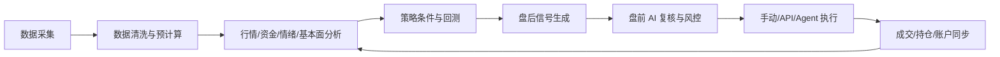
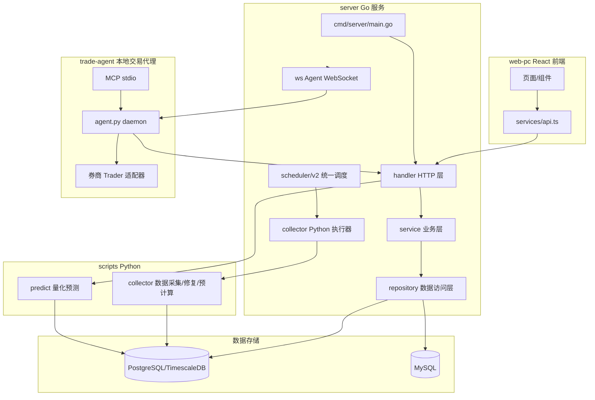
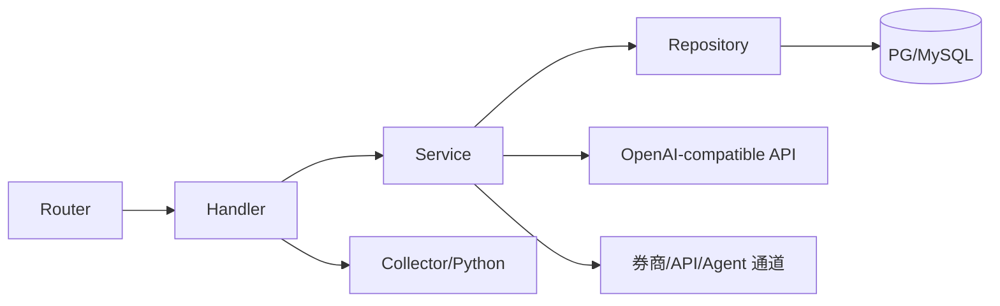
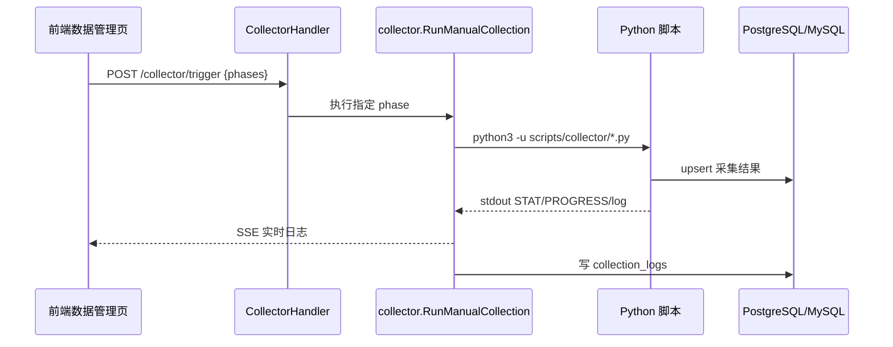
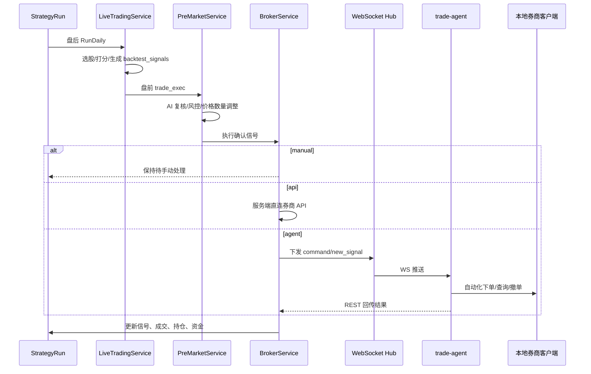
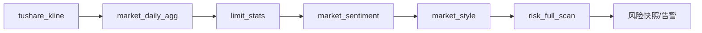
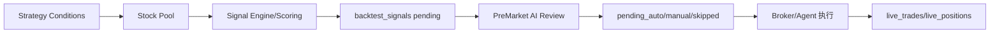
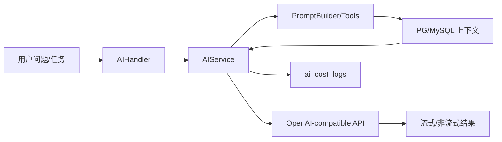

# 智策投研系统架构与功能文档

> 更新时间：2026-07-11  
> 依据当前仓库代码梳理，覆盖 Go 后端、React 前端、Python 数据采集/预测、本地交易 Agent 与部署脚本。

## 1. 系统定位

智策投研是一个面向 A 股的投研、策略、风控与交易执行平台。系统从多数据源采集行情、财务、公告、研报、资金面和市场情绪数据，沉淀到双数据库底座，再由 Go 服务层提供行情看板、策略回测、AI 分析、风控扫描、实盘信号生成和本地 Agent 自动交易能力。

核心目标不是单一预测，而是形成完整闭环：

## 2. 总体架构

## 3. 代码目录职责

| 目录 | 职责 |
|---|---|
| `server/cmd/server` | Go 服务入口，初始化配置、数据库、迁移、调度器、路由和 WebSocket。 |
| `server/internal/handler` | HTTP Handler 层，负责参数校验、鉴权上下文、响应格式和入口编排。 |
| `server/internal/service` | 业务逻辑层，包含 AI、策略、回测、风控、实盘交易、券商、通知等核心能力。 |
| `server/internal/repository` | 数据访问层，封装股票、榜单、自选、策略等查询。 |
| `server/internal/model` | GORM 模型，覆盖 PG 股票数据和 MySQL 业务数据。 |
| `server/internal/db` | PG/MySQL 连接、版本化迁移、默认数据初始化。 |
| `server/internal/collector` | Go 侧采集调度执行器，负责调用 Python 脚本、SSE 输出和采集日志。 |
| `server/internal/scheduler/v2` | 统一调度器，注册系统流水线、独立任务和实盘策略任务。 |
| `server/internal/ws` | 本地交易 Agent 的 WebSocket Hub、命令下发和测试通道。 |
| `web-pc/src` | React 19 + Vite + Arco Design 前端应用。 |
| `scripts/collector` | 数据采集、修复、回填、预计算脚本。 |
| `scripts/predict` | GRU/LSTM/XGBoost/ARIMA/Transformer/Prophet 等预测脚本。 |
| `trade-agent` | 本地自动交易代理，连接服务端信号与本地券商客户端。 |
| `docker` | PostgreSQL、MySQL、服务端容器编排和 Nginx 示例。 |

## 4. 后端运行时

服务入口在 `server/cmd/server/main.go`。启动流程：

1. 读取 `PORT`、`POSTGRES_DSN`、`MYSQL_DSN`。
2. 初始化 PostgreSQL 与 MySQL。
3. 执行版本化迁移 `db.AutoMigrate()` 和兼容性表初始化。
4. 创建默认管理员用户。
5. 清理服务重启遗留的运行中回测任务。
6. 启动 `scheduler/v2` 统一调度器，并注册系统流水线。
7. 初始化 legacy `TaskManager`，兼容旧的 `scheduled_tasks` 管理。
8. 注册公开 API、鉴权 API、管理员 API、实盘 Agent API 和 WebSocket。

后端采用经典分层：

## 5. 数据库架构

系统使用双库：

| 数据库 | 定位 | 主要数据 |
|---|---|---|
| PostgreSQL + TimescaleDB | 股票核心数据与分析结果 | 股票基础、K 线、指标、概念、行业、公告、资讯、研报、资金流、市场情绪、市场风格、AI 分析、预测结果。 |
| MySQL | 用户与交易业务数据 | 用户、会话、API Key、自选股、策略、回测、持仓、交易账户、实盘运行、信号、通知、风控告警、采集日志、调度日志、AI 成本。 |

重要 PG 表：

| 表/模型 | 说明 |
|---|---|
| `stocks_basic` | 股票基础信息，含板块类型、ST 标识、申万行业字段。 |
| `stocks_daily_k` | 日 K 数据，含价格、成交量、涨跌幅、振幅、MACD 预计算等字段。 |
| `stocks_daily_indicator` | PE/PB/PS、市值、换手率、股本、股息率等 daily basic 指标。 |
| `stock_realtime_quote` | 盘中实时行情快照。 |
| `stock_financials`、`stock_shareholders` | 财务与股东数据。 |
| `stock_reports`、`stock_news`、`cninfo_announcements`、`macro_news` | 研报、个股资讯、巨潮公告、宏观资讯。 |
| `concept_boards`、`stock_concepts`、`concept_analyses` | 概念板块、个股概念关联、AI 概念分析缓存。 |
| `market_sentiment`、`market_style_daily`、`limit_stats_daily` | 市场情绪、市场风格、涨跌停情绪预计算。 |
| `northbound_flow`、`stock_fund_flow`、`stock_capital_flow`、`margin_trading`、`dragon_tiger_*`、`block_trade` | 资金面、北向、融资融券、龙虎榜和大宗交易。 |
| `ai_system_configs`、`ai_analyses`、`ai_stock_scores`、`stock_profiles` | AI 提示词配置、对话分析、六维评分和公司画像。 |
| `predictions`、`prediction_kdist` | 多模型预测结果和图表辅助数据。 |

重要 MySQL 表：

| 表/模型 | 说明 |
|---|---|
| `users`、`sessions`、`login_logs` | 用户、登录态和登录审计。 |
| `ai_configs`、`ai_cost_logs`、`model_prices` | 用户 AI 配置、调用成本和模型单价。 |
| `watchlists`、`watchlist_groups` | 自选股与分组。 |
| `strategies`、`strategy_conditions`、`condition_templates` | 策略定义、条件与模板。 |
| `backtest_tasks`、`backtest_results`、`backtest_signals`、`backtest_execution_logs`、`backtest_daily_snapshots` | 回测任务、结果、信号、日志和快照。 |
| `trading_accounts`、`strategy_runs`、`live_positions`、`live_trades`、`daily_portfolio_snapshots` | 多账户、实盘策略运行、持仓、成交和净值快照。 |
| `pre_market_tasks`、`pre_market_decisions`、`run_execution_logs` | 盘前交易执行任务、AI 决策和运行日志。 |
| `risk_alerts`、`risk_rules`、`risk_snapshots` | 风控告警、规则配置和每日风险快照。 |
| `scheduled_tasks`、`task_logs`、`collection_logs` | 调度任务、执行日志和采集记录。 |
| `api_keys` | 外部团队数据导入 API Key。 |

迁移集中在 `server/internal/db/migrations_data.go`，当前已演进到 v90。新增表、视图、索引或字段时，应继续追加版本化迁移，并同步 `docs/sql-fixes/` 修复 SQL。

## 6. 数据采集与预计算

采集体系由 Go 统一触发，Python 执行具体数据源抓取：

主要 phase：

| Phase | 脚本/实现 | 说明 |
|---|---|---|
| `full_sync` | `full_sync.py` | 同步 A 股股票列表。 |
| `kline` | `batch_collect.py` + `collect_index_kline.py` | 近日日 K、指数和债券 ETF。 |
| `tushare_kline` | `tushare_kline.py` | Tushare 全市场日 K。 |
| `tushare_indicator` | `tushare_indicator.py` | Tushare daily_basic 指标。 |
| `industry` | `populate_industry.py` | 行业分类填充。 |
| `concept` / `concept_full` | Go 概念采集 / `rebuild_concepts.py` | 概念板块增量与全量重建。 |
| `financial` / `backfill_financial` | `financial_collect.py` / `backfill_financial.py` | 财务数据增量与全量回填。 |
| `shareholder` / `backfill_shareholder` | `shareholder_collect.py` / `backfill_shareholder.py` | 股东数据增量与回填。 |
| `news`、`macro_news`、`cninfo`、`reports` | 对应采集脚本 | 个股资讯、宏观资讯、公告、研报。 |
| `dragon_tiger`、`margin`、`block_trade`、`unlock`、`dividend`、`ths_eps`、`ths_hot` | 对应采集脚本 | 资金面、事件和主题热度数据。 |
| `fund_flow`、`northbound` | 对应采集脚本 | 个股资金流和北向资金。 |
| `market_daily_agg` | `precompute_aggs.py` | 市场日聚合，如涨跌家数、成交额、MA20 站上数。 |
| `limit_stats` | `collect_limit_stats.py` | 涨跌停统计预计算。 |
| `market_sentiment` | `compute_sentiment.py` | 市场情绪与恐慌贪婪相关指标。 |
| `market_style` | `compute_market_style.py` / Go service | 市场风格、结构强弱和风格点评。 |
| `quote` | `realtime_quotes.py` | 自选、持仓、榜单股票实时行情。 |
| `profile`、`score` | AI 采集脚本 | 公司画像和 AI 六维评分批处理。 |

支持单股修复：

| 入口 | 说明 |
|---|---|
| `POST /stocks/:code/repair` | 调用 `repair_kline.py`，删除、重采、重算单股数据。 |
| `POST /collector/stock/:code` | 对单股执行 shareholder/financial/news 等 phase。 |
| `GET /collector/stock/:code/:phase` | 单股采集 SSE 反馈。 |

## 7. 调度系统

`scheduler/v2` 是当前主调度框架，支持：

| 能力 | 说明 |
|---|---|
| Pipeline | 多阶段 DAG，支持依赖、超时、重试、完成事件。 |
| TaskDefinition | 系统任务、策略任务统一定义。 |
| TaskInstance | 系统级实例和策略运行级实例。 |
| StructuredLogger | 结构化执行日志。 |
| EventBus | 数据就绪、盘前就绪等事件联动。 |

系统内置两条流水线：

| Pipeline | 触发 | 阶段 |
|---|---|---|
| `after_close_data` 盘后数据采集 | 交易日 16:10:40 | `tushare_kline` → `market_daily_agg` → `limit_stats` → `market_sentiment` → `market_style` → `risk_full_scan` |
| `pre_market_data` 盘前数据采集 | 交易日 08:00 | `concept` 与 `cninfo`，之后 `risk_event_scan` |

系统级独立任务包含实时行情、盘中 K 线、资讯、宏观资讯、同花顺热点、北向资金、龙虎榜、股东、研报、大宗交易、Tushare 指标、融资融券、行业分类、股票列表同步、财务、概念全量重建、解禁、分红和一致预期等。

实盘策略任务由具体 `strategy_run` 注册，包括：

| 任务 | 说明 |
|---|---|
| `live_daily_run` | 盘后策略执行，生成 T+1 信号。 |
| `live_trade_exec` | 盘前交易执行复核与信号确认。 |
| `live_position_patrol` | 持仓止盈止损巡检。 |
| `live_snapshot` | 盘后净值和持仓快照。 |
| `live_position_refresh` | 盘中持仓市值刷新。 |
| `daily_t1_unlock` | 开盘前 T+1 可卖数量解锁。 |
| `order_sync` | 盘中委托状态同步。 |

## 8. 前端产品结构

前端入口为 `web-pc/src/main.tsx`，路由在 `router.tsx`，布局和侧边栏在 `App.tsx`。所有业务 API 统一封装在 `services/api.ts`，默认代理 `/api/v1`。

侧边栏按产品域分组：

| 分组 | 页面 | 功能 |
|---|---|---|
| 行情看板 | 今日榜单、历史榜单、上榜热力图、概念板块、行业对比 | 查看算法选股、历史表现、概念/行业结构和热力数据。 |
| 数据挖掘 | 龙虎榜、题材热度、解禁日历、公告检索、宏观资讯 | 挖掘事件、资金、公告和宏观信息。 |
| 交易决策 | 股票列表、自选股、交易策略、策略 PK、持股管理、实盘交易 | 从个股筛选到策略、回测、持仓和实盘运行。 |
| 风控分析 | 风险监控、市场情绪、资金面分析、涨跌停情绪、恐慌贪婪指数、市场风格 | 组合、市场、资金和情绪风险监控。 |
| 系统 | 数据管理、系统设置、用户管理、个人设置、成本统计 | 数据采集、AI 配置、用户权限、API Key、调度和成本管理。 |

通用前端能力：

| 能力 | 实现 |
|---|---|
| 鉴权 | `AuthContext` + access/refresh token，401 自动刷新。 |
| 主题 | `ThemeContext`，支持明暗主题。 |
| 错误提示 | axios 拦截器派发 `app:toast`，统一 Toast 展示。 |
| 路由保护 | `ProtectedRoute` 未登录跳转 `/login`。 |
| 实时数据 | 指数轮询、采集 SSE、AI 流式分析、实盘任务轮询。 |

## 9. 主要功能域

### 9.1 行情与个股研究

| 功能 | 后端入口 | 数据来源 |
|---|---|---|
| 股票列表、搜索、排序、板块过滤 | `/stocks` | `stocks_basic` + 最新 K 线。 |
| 市场快照、涨跌家数、成交额 | `/stocks/market-snapshot` | `market_daily_agg`、`market_sentiment`、`stocks_daily_k`。 |
| 个股详情 | `/stocks/:code` | 股票基础数据。 |
| K 线与技术指标 | `/stocks/:code/kline`、`/stocks/:code/indicator` | `stocks_daily_k`、`stocks_daily_indicator`。 |
| 财务、股东、资讯、研报 | `/stocks/:code/financials` 等 | PG 各采集表。 |
| 资金流、龙虎榜、大宗、解禁、公告 | 多个 `/stocks/:code/*` API | 资金面和事件表。 |
| 个股 AI 分析和评分 | `/ai/analyze`、`/ai/score/:code`、`/ai/profile/:code` | AI 配置 + 股票上下文工具。 |

### 9.2 榜单、概念和行业

| 功能 | 说明 |
|---|---|
| 今日榜单 | 展示算法选股结果、排名、评分、建议和风险标签。 |
| 历史榜单 | 按日期回看榜单，验证上榜后表现。 |
| 上榜热力图 | 查看个股多日上榜和涨跌表现。 |
| 概念板块 | 概念列表、成分股、板块 K 线、概念热力图。 |
| 概念 AI 分析 | 对概念板块进行 AI 缓存分析，可刷新。 |
| 行业对比 | 行业涨跌、强弱、成分股排序和行业热力。 |

### 9.3 市场情绪、资金面和风格

| 功能 | 说明 |
|---|---|
| 市场情绪 | 历史情绪、分项指标、收益分布、指数 K 线。 |
| 恐慌贪婪指数 | 基于市场宽度、涨跌停、北向、波动等因子聚合。 |
| 涨跌停情绪 | 涨停/跌停数量、炸板、连板等统计。 |
| 资金面分析 | 北向趋势、资金流榜、融资融券趋势和个股资金排名。 |
| 市场风格 | 趋势、波动、结构、风格分类、领涨行业/概念和每日点评。 |

### 9.4 策略、回测和策略 PK

| 功能 | 说明 |
|---|---|
| 策略 CRUD | 策略名称、条件、仓位、风险参数和执行配置。 |
| 指标库与测试 | 技术、资金、估值、行业等指标条件配置和单指标测试。 |
| AI 生成策略 | 根据自然语言生成策略条件，支持提示词优化。 |
| Orchestration v2 | 支持 scoring、decision_tree、hybrid 编排模式。 |
| 回测任务 | 异步启动、状态查询、日志、快照、个股分析和结果归档。 |
| 策略 PK | 创建比赛、报名策略、启动/关闭事件、查看策略表现排名。 |

### 9.5 持仓、风控和通知

| 功能 | 说明 |
|---|---|
| 持仓管理 | 多账户持仓、成本、买入日期、账户资产和交易记录。 |
| 风控扫描 | 对市场、个股、组合、流动性、事件、行为等维度生成告警。 |
| 风控规则 | `risk_rules` 可配置启停、阈值和权重。 |
| 风险仪表盘 | 告警列表、聚合、详情、确认、熔断状态和风险快照。 |
| 通知配置 | 实盘运行可配置通知渠道，并支持测试发送。 |

### 9.6 AI 能力

AI 服务兼容 OpenAI Chat Completions API，由用户在系统设置中配置 `BaseURL`、`APIKey` 和模型名。

| 场景 | 说明 |
|---|---|
| 个股对话分析 | 支持流式输出，可调用股票价格、K 线、技术、财务、新闻、持仓、股东等工具。 |
| AI 六维评分 | 基本面、成长、估值、资金、技术、行业六维评分。 |
| 公司画像 | 生成结构化 Markdown 公司简介。 |
| 策略生成/优化 | 从自然语言生成策略条件或优化用户描述。 |
| 概念分析 | 对概念板块做机会、风险和驱动因素分析。 |
| 盘前 TradingAgents 复核 | 多角色分析、牛熊辩论、交易员决策、风控/PM 审核。 |
| 成本统计 | 每次 AI 调用记录 tokens、模型、耗时、成功状态和估算成本。 |

### 9.7 预测模型

预测入口在 `/prediction/:code`，由 Go 并发调用 `scripts/predict` 下的 6 个模型脚本：

| 模型 | 脚本 |
|---|---|
| GRU | `gru_predict.py` |
| LSTM | `lstm_predict.py` |
| XGBoost | `xgb_predict.py` |
| ARIMA | `arima_predict.py` |
| Transformer | `transformer_predict.py` |
| Prophet | `prophet_predict.py` |

预测结果写入 `predictions`，唯一键为 `code + model_name + predict_date`。`/forecast/:code` 目前是轻量模拟预测接口，适合页面占位或演示，不等价于真实模型预测。

## 10. 实盘交易闭环

实盘交易由服务端和本地 Agent 共同完成。

执行通道：

| 通道 | 服务端含义 | 典型 broker |
|---|---|---|
| `manual` | 只生成待确认信号，由用户手动处理。 | `manual` |
| `api` | 服务端通过券商 API 直接操作。 | `mx_moni` |
| `agent` | 服务端通过 WebSocket 指令交给本地 Agent。 | `lobster`、未来本地客户端 |

`trade-agent` 模式：

| 模式 | 说明 |
|---|---|
| `daemon` | 常驻进程，WS 实时接收指令，HTTP 轮询兜底，执行后回传结果。 |
| `mcp` | 暴露 MCP stdio 工具，供 AI Agent 查询和执行信号。 |
| `test-broker` | 测试券商连接、资金和持仓读取。 |
| `calibrate` | 校准东方财富 Mac 自绘 tab 坐标。 |

本地执行器：

| `broker_mode` | 实现 | 说明 |
|---|---|---|
| `eastmoney_mac` | macOS Accessibility API + pyautogui | 东方财富 Mac 客户端自动化。 |
| `eastmoney_web` | Playwright | 东方财富网页版自动化。 |
| `lobster` | 本地 API/SDK 预留 | 龙虾客户端。 |

## 11. 认证与权限

| 场景 | 机制 |
|---|---|
| 前端用户 | `/auth/login` 获取 access/refresh token，业务 API 走 Bearer Token。 |
| 刷新登录态 | axios 401 自动调用 `/auth/refresh`，失败后退出。 |
| 管理员接口 | `/admin/*` 额外经过 `AdminMiddleware`。 |
| 外部数据导入 | `/data/import` 使用 API Key 鉴权，API Key 由管理员管理。 |
| 本地 Agent | `X-Agent-Token` 或 query token，绑定 `trading_accounts.agent_token`。 |
| WebSocket Agent | `/api/v1/ws/signals?token=...`，连接后上报 `agent_hello` 能力。 |

## 12. 部署与运行

容器镜像使用多阶段构建：

1. `golang:1.25-alpine` 编译 Go 服务。
2. `python:3.12-slim` 安装采集依赖。
3. 镜像内复制 Go 二进制与 `scripts/`。

Compose 服务：

| 服务 | 端口 | 说明 |
|---|---|---|
| `postgres` | `5432` | TimescaleDB PG16，股票核心数据。 |
| `mysql` | `3307 -> 3306` | MySQL 8，业务数据。 |
| `server` | `8080` | Go API + Python 采集运行时。 |

前端：

| 环境 | 说明 |
|---|---|
| 本地开发 | `web-pc` 下 `npm run dev`，Vite 代理 `/api` 到 `127.0.0.1:8080`。 |
| 生产部署 | `npm run build` 后将 `web-pc/dist` 发布到 Nginx/宝塔静态目录。 |

发布脚本：

| 脚本 | 说明 |
|---|---|
| `publish.sh` | 本地使用 buildx 构建 linux/amd64 镜像并推送到阿里云镜像仓库。 |
| `deploy.sh` | 服务器端拉代码、拉镜像、重启 server、构建前端并 rsync 到生产目录。 |

## 13. 关键数据流

### 13.1 日常盘后数据流

### 13.2 策略到实盘信号

### 13.3 AI 分析数据流

## 14. 扩展点

| 扩展方向 | 推荐入口 |
|---|---|
| 新增采集数据源 | `scripts/collector/new_source.py` + `collector/engine.go` phase + DB migration。 |
| 新增调度任务 | `scheduler/v2/pipelines.go` 中新增 TaskDefinition 或 PipelineStage。 |
| 新增股票分析页面 | `web-pc/src/pages` + `services/api.ts` + 后端 handler/service/repo。 |
| 新增策略指标 | `indicator_registry.go`、策略条件解析、回测/信号引擎同步支持。 |
| 新增 AI 场景 | `ai_system_configs` 默认提示词 + AIHandler/Service 方法 + 成本 module。 |
| 新增券商 API | 实现 `service.Broker`，在 BrokerService 通道路由中注册。 |
| 新增本地券商客户端 | `trade-agent/traders` 实现 `AbstractTrader`，在 factory 注册并补预检。 |
| 新增表/视图/索引 | `migrations_data.go` 追加版本，另写 `docs/sql-fixes/YYYY-MM-DD_*.sql`。 |

## 15. 当前维护关注点

| 关注点 | 说明 |
|---|---|
| 迁移版本重复 | `migrations_data.go` 中历史上存在重复版本号片段，继续新增时应先核对版本序列。 |
| 新旧调度共存 | `scheduler/v2` 是主调度，`TaskManager` 仍为兼容旧 `scheduled_tasks` 存在。 |
| 采集全局状态 | `collector` 有全局进度与 per-phase 锁，流水线中部分阶段仍串行以规避锁冲突。 |
| 预测接口差异 | `/prediction/:code` 调真实 Python 模型，`/forecast/:code` 是模拟预测。 |
| 实盘执行安全 | Agent Token 与账户绑定；实盘自动化依赖本地客户端状态、校准和预检结果。 |
| AI 成本控制 | 盘前复核有每日信号数量上限，所有 AI 调用会记录成本日志。 |

## 16. 常用入口速查

| 事项 | 入口 |
|---|---|
| 后端入口 | `server/cmd/server/main.go` |
| 路由总览 | `server/cmd/server/main.go` |
| 前端路由 | `web-pc/src/router.tsx` |
| 前端 API | `web-pc/src/services/api.ts` |
| 数据库迁移 | `server/internal/db/migrations_data.go` |
| 采集 phase | `server/internal/collector/engine.go` |
| 调度定义 | `server/internal/scheduler/v2/pipelines.go` |
| 实盘路由 | `server/internal/handler/live_trading_handler.go` |
| 实盘服务 | `server/internal/service/live_trading_service.go`、`pre_market_service.go`、`broker_service.go` |
| 本地 Agent | `trade-agent/agent.py` |
| Agent 协议 | `trade-agent/API_DOCS.md` |
| Docker 编排 | `docker/docker-compose.yml` |
| 镜像构建 | `Dockerfile`、`publish.sh` |
